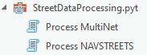

# Street Data Processing Tools (ArcGIS Pro version)

The tools process shapefile data from TomTom® MultiNet® into a file geodatabase network dataset.  HERE™ NAVSTREETS™ data is not yet supported. This version of the toolbox must be run in ArcGIS Pro.

## Software Requirements
* ArcGIS Pro 2.9 or later (The tool may run successfully on earlier version of ArcGIS Pro but has not been tested.)
* Basic license or higher
* ArcGIS Network Analyst Extension

## Installation
No special installation is needed.  Simply download the latest version of [StreetDataProcessingTools_v*.zip](https://github.com/ArcGIS/street-data-processing-tools/releases/latest) file and extract it or clone this repository.

To use the tools, add the `for-ArcGIS-Pro\StreetDataProcessing.pyt` toolbox to an ArcGIS Pro project from the Catalog Pane.  You will find the `Process MultiNet` tool in this toolbox.

## Tool documentation

### Tool inputs
- **Input Network Geometry (NW) Feature Class** (Python: *in_network_geometry_fc*): The TomTom® MultiNet® network geometry feature class.
- **Input Manuevers Geometry (MN) Feature Class** (Python: *in_maneuvers_geometry_fc*): The TomTom® MultiNet® maneuvers geometry feature class.
- **Input Maneuver Path Index (MP) Table** (Python: *in_maneuver_path_index_table*): The TomTom® MultiNet® manuever path index table.
- **Input Sign Information (SI) Table** (Python: *in_sign_information_table*): The TomTom® MultiNet® sign information table.
- **Input Sign Path (SP) Table** (Python: *in_sign_path_table*): The TomTom® MultiNet® sign path table.
- **Input Restrictions (RS) Table** (Python: *in_restrictions_table*): The TomTom® MultiNet® restrictions table.
- **Output Folder** (Python: *output_folder*): The folder where the output geodatabase containing the new network dataset will be created.
- **Output Geodatabase Name** (Python: *output_geodatabase_name*): The name for the output geodatabase that will be created.
- **Unit Type** (Python: *unit_type*): Whether the network dataset's attributes should use imperial or metric units. Valid options include `Imperial` and `Metric`.
- **Build the network dataset** (Python: *build_network*): Boolean indicating whether to build the output network dataset immediately after creating it.  After this tool creates the network dataset, if you intend to make further changes to it prior to performing any analysis, you may want to set this parameter to false so that the network dataset isn't built just yet.  Once you've completed making the additional changes, then you can run the Build Network tool to build the network dataset.
- **Input Logistics Truck Routes (LTR) Table** (Python: *in_logistics_truck_routes_table*): The TomTom® MultiNet® logistics truck routes table. This table is optional. Including it will add additional fields to the Streets feature class and additional restriction attributes and travel modes for trucking in the network dataset.
- **Include historical traffic** (Python: *include_historical_traffic*) Boolean indicating whether to include historical traffic data in the network dataset.
- **Input Network Profile Link (HSNP) Table** (Python: *in_network_profile_link_table*): The TomTom® MultiNet® network profile link table. This table is required if **Include historical traffic** is true.
- **Input Historical Speed Profiles (HSPR) Table** (Python: *in_historical_speed_profiles_table*): The TomTom® MultiNet® historical speed profiles table. This table is required if **Include historical traffic** is true.
- **Input RDS-TMC Information (RD) Table** (Python: *in_rds_tmc_info_table*): The TomTom® MultiNet® RDS-TMC information table. This table is optional and only used if **Include historical traffic** is true.
- **Include MultiNet Logistics restriction data** (Python: *include_multinet_logistics_restriction_data*): Boolean indicating whether to include extended logistics restrictions in the network dataset.
- **Input Logistics Restrictions (LRS) Table** (Python: *in_logistics_restrictions_table*): The TomTom® MultiNet® logistics restrictions table.  This table is required if **Include MultiNet Logistics restriction data** is true.
- **Input Logistics Vehicle Characteristics (LVC) Table** (Python: *in_logistics_vehicle_characteristics_table*): The TomTom® MultiNet® logistics vehicle characteristics table.  This table is required if **Include MultiNet Logistics restriction data** is true.
- **Time Zone Type** (Python: *time_zone_type*): How to handle time zones in the network dataset.
  - `None`: Do not include a time zone attribute in the network dataset.
  - `Single time zone`: A time zone attribute is created, and all features in the network dataset are assigned to the time zone specified in the **Time Zone Name** parameter.
  - `Use time zone table`: A time zone attribute is created, and features in the network dataset are assigned to time zones according to an input table specified in the **Input Time Zone Table** parameter.
- **Time Zone Name** (Python: *time_zone_name*): If **Time Zone Type** is `Single time zone`, this parameter specifies the name of the time zone.  This parameter is ignored for other values of **Time Zone Type**.
- **Input Time Zone Table** (Python: *in_time_zone_table*): If **Time Zone Type** is `Use time zone table`, this parameter specifies the table defining the time zones.  This parameter is ignored for other values of **Time Zone Type**.
- **Input FT Time Zone ID Field Name** (Python: *in_ft_time_zone_field_name*): If **Time Zone Type** is `Use time zone table`, this parameter specifies the field in the **Input Network Geometry (NW) Feature Class** defining the feature's time zone in the feature's From-To direction (in the direction of digitization).  This parameter is ignored for other values of **Time Zone Type**.
- **Input TF Time Zone ID Field Name** (Python: *in_tf_time_zone_field_name*): If **Time Zone Type** is `Use time zone table`, this parameter specifies the field in the **Input Network Geometry (NW) Feature Class** defining the feature's time zone in the feature's To-From direction (against the direction of digitization).  This parameter is ignored for other values of **Time Zone Type**.

## Tool Output

A file geodatabase is created in the designated **Output Folder** with the designated **Output Geodatabase Name**.  This geodatabase includes the set of feature classes and tables used by the network dataset, which is created as `Routing_ND` in the `Routing` feature dataset.

The set of tables created depends on the tool options selected.

If the **Build the network dataset** parameter was set to True, the network dataset has been built and is ready for use.  Otherwise, you must run the Build Network tool before using the network for analysis.

## Issues

Find a bug or want to request a new feature?  Please let us know by submitting an issue.

## Contributing

Esri welcomes contributions from anyone and everyone. Please see our [guidelines for contributing](https://github.com/esri/contributing).

## Licensing
Copyright 2022 Esri

Licensed under the Apache License, Version 2.0 (the "License");
you may not use this file except in compliance with the License.
You may obtain a copy of the License at

   http://www.apache.org/licenses/LICENSE-2.0

Unless required by applicable law or agreed to in writing, software
distributed under the License is distributed on an "AS IS" BASIS,
WITHOUT WARRANTIES OR CONDITIONS OF ANY KIND, either express or implied.
See the License for the specific language governing permissions and
limitations under the License.

A copy of the license is available in the repository's [license.txt](license.txt) file.

​​​​​​​​​​​​​​​
